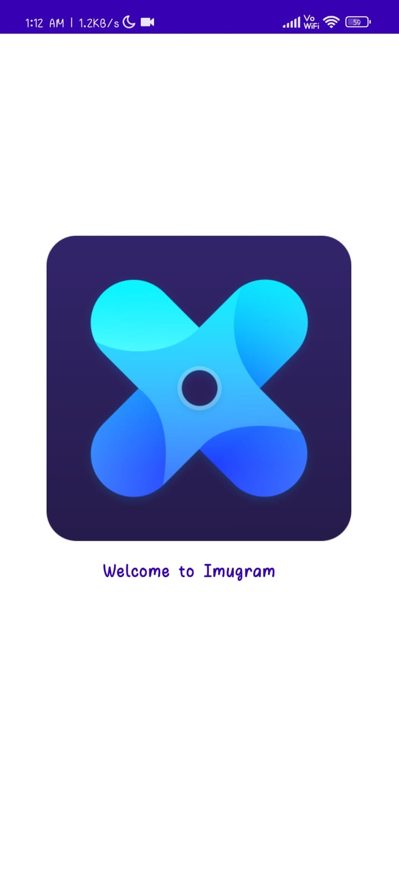

# Imguram

Our Imugram app leverages the power of the Imgur API, providing users with a seamless and engaging social media experience. Using Retrofit 2 for efficient network requests, we've ensured fast and reliable data retrieval, allowing users to effortlessly share and explore their favorite moments.

Dagger Hit takes care of dependency injection, ensuring a clean and maintainable codebase. This allows for easy scaling and adaptability, making it a robust choice for long-term development.

To enhance image loading and display, we've integrated Coil-kt, offering smooth and high-performance image loading capabilities. This means that your app loads images quickly and efficiently, providing an exceptional user experience.

With our Imugram app, users can see Status of His Friends , all while enjoying a responsive and visually appealing platform. It's the ideal solution for those who seek a feature-rich, performant, and user-friendly social media experience."

# Screen Shots
## Login Page 

## Splash Screen

## Home Page

## Hots

## Story

